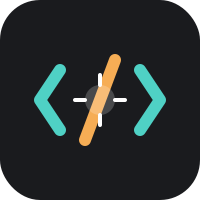
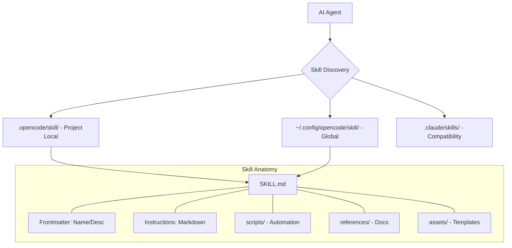

#  OpenCode Skills

[](https://opensource.org/licenses/MIT)
[](https://bun.sh)
[](https://python.org)
[](https://opencode.ai)

> **Modular, self-contained "Skills" that extend AI capabilities with specialized knowledge, workflows, and tool integrations.**

---

## 🚀 Overview

OpenCode Skills is a framework for building and managing **AI Skills**. A "Skill" is more than just a prompt; it's a packaged unit of procedural knowledge, automation scripts, and reference materials that transform a general-purpose AI into a domain expert.

While currently optimized for `~/.opencode`, these skills can be dropped into **any project** to provide immediate context and specialized tools to AI agents (like GitHub Copilot, Claude, or custom OpenCode agents).

---

## 🧠 What are Skills?

Skills are "onboarding guides" for AI. They provide:

1. **Specialized Workflows**: Multi-step procedures for specific domains.
2. **Tool Integrations**: Instructions for working with specific APIs or file formats.
3. **Domain Expertise**: Schemas, business logic, and quality standards.
4. **Bundled Resources**: Scripts for deterministic tasks and assets for output generation.

---

## 🏗️ Architecture

The following diagram illustrates how agents discover and load skills within the OpenCode ecosystem.



---

## 🛠️ Getting Started

### 1. Installation

Ensure you have [Bun](https://bun.sh) and [Python](https://python.org) installed.

```bash
# Clone to your local config or project root
git clone https://github.com/ssdeanx/AI-Skills.git ~/.opencode
```

### 2. Creating a New Skill

Use the built-in generator to scaffold a new skill:

```bash
python skills/skill-creator/scripts/init_skill.py my-new-skill --path skills
```

### 3. Validation & Packaging

Before sharing or using a skill, validate its structure:

```bash
python skills/skill-creator/scripts/quick_validate.py skills/my-new-skill
python skills/skill-creator/scripts/package_skill.py skills/my-new-skill
```

---

## 📂 Project Structure

```bash
.
├── .github/                # AI Instructions & Workflows
├── assets/                 # Project branding & logos
├── skills/                 # The Skill Library
│   ├── skill-creator/      # Meta-skill for building skills
│   ├── icon-generator/     # UE & Web icon automation
│   ├── web-ui-ux/          # Design & Accessibility guidance
│   └── ...                 # More specialized skills
├── package.json            # Bun dependencies
└── bun.lock                # Lockfile
```

---

## 🔧 Advanced Usage

### Project-Level Integration

To use these skills in a specific project, simply copy the desired skill folder into your project's `.opencode/skill/` directory. AI agents will automatically prioritize these local versions.

### Progressive Disclosure

Skills are designed to be **context-efficient**.

- **Metadata** is always loaded.
- **SKILL.md** is loaded only when the skill triggers.
- **References/Scripts** are loaded only when explicitly needed by the agent.

---

## 📊 Project Metadata

```yaml
project:
  name: OpenCode Skills
  version: 1.0.0
  status: active
  stack: [Bun, Python, Markdown]
  compatibility: [GitHub Copilot, Claude, OpenCode]
  license: MIT
```

---

## 🤝 Contributing

We welcome new skills! Please follow the [AGENTS.md](skills/AGENTS.md) guidelines and use the `skill-creator` to ensure compatibility.

---

<p align="center">
  Built with ❤️ for the OpenCode Ecosystem
</p>
